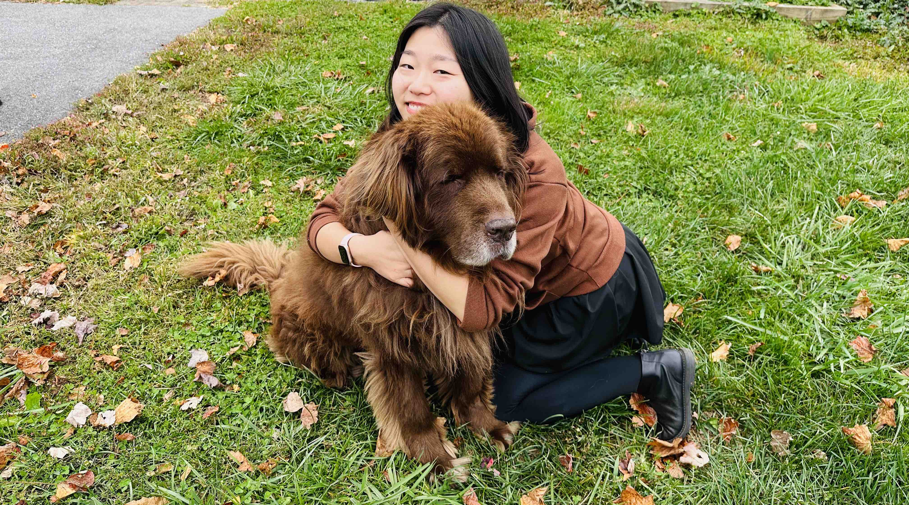

I am a psycholinguistic researcher and a fifth-year [PhD student](https://arhusynergy.umd.edu/graduate-research/VoicesBlog#Secrets) in the [Second Language Acquisition program](https://sllc.umd.edu/directory/zhiyi-jenny-wu) at the University of Maryland - College Park (UMCP). I work under the guidance of [Kira Gor](https://sllc.umd.edu/directory/kira-gor), [Nan Jiang](https://sllc.umd.edu/directory/nan-jiang), and [Bronson Hui](https://bronson-hui.github.io/index.html). My research focuses on the acquisition and processing of various aspects of second language, with a focus on phonology and lexical units, from the psycholinguistic perspective. Additionally, I am interested in examining the reliability of psycholinguistic measures commonly used in second language research, aiming to contribute to the development of more robust methodologies in the field.

**How to pronounce my first name:** /tʂʅ i/ _"Gee-Eee" also works_

**Email:** zhiyiw1@umd.edu
