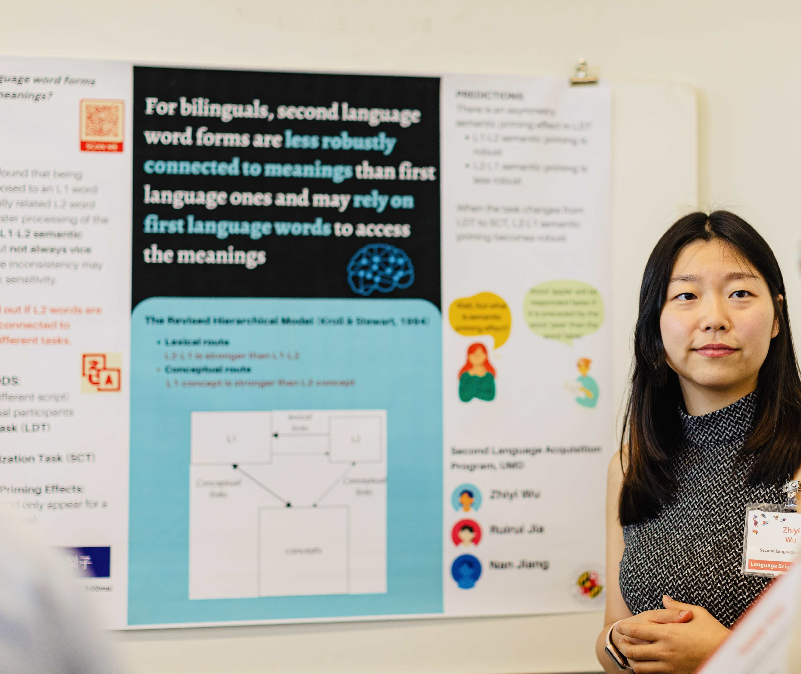

I am a third-year [PhD student](https://arhusynergy.umd.edu/graduate-research/VoicesBlog#Secrets) in the [Second Language Acquisition program](https://sllc.umd.edu/directory/zhiyi-jenny-wu) at University of Maryland - College Park (UMCP). I work with [Kira Gor](https://sllc.umd.edu/directory/kira-gor) and [Nan Jiang](https://sllc.umd.edu/directory/nan-jiang). My research interests include the learning and processing of second language phonology, lexical units, and syntax, from both the psycholinguistic and the neurolinguistic perspectives.

**How to pronounce my first name:** /tʂʅ i/ _"Gee-Eee" also works_

**Email:** zhiyiw1@umd.edu

# **Research**
I'm interested in how the language(s) we already know affect how we process and learn a new language, and how the smaller units of the language are represented in the mind and the brain. 

## **Current Research**

**First-language Influence on Second-language Processing**

I am currently working with [Kira Gor](https://sllc.umd.edu/directory/kira-gor) on the learning of nonnative phonology as well as words. I examine and compare learners of Spanish who speak American English and Mandarin Chinese as their first languages. 

**Semantic Priming Effects in different word processing tasks**

In the meantime, I work with [Nan Jiang](https://sllc.umd.edu/directory/nan-jiang) on the second-language-to-first-language semantic priming effects by using both the more traditional Lexical Decision Task and the less influential Semantic Categorization Task.

**The Acquisition of Lexical Tones by Second Language Learners**

I have gotten interested in learning how various factors could influence the perception and production of lexical tones, mainly in Mandarin Chinese, by late learners.

## **Presentations**

'**The role of native phonology in speech perception and phonolexical encoding among Spanish learners.**' (March 2023).An individial paper presentation at _American Association for Applied Linguistics Annual Conference_.

'**How do language(s) we know influence how we learn a new language?**' (October 2022). A poster presentation at the Language Science Day at UMCP.

'**How are second-language wordforms connected to their meanings?**' (October 2022). A poster co-presentation with [Ruirui Jia](https://www.researchgate.net/profile/Ruirui-Jia) at the Language Science Day at UMCP.

‘**Syntactic prediction in L2 learners**.’ (September 2022). A co-presentation with [Shaohua Fang](https://www.researchgate.net/profile/Shaohua-Fang-3) at the SLA seminar in the Second Language Acquisition graduate program at UMCP.

## **Publications**

**Wu, Zhiyi**, & Hui, Bronson (September 2023). _Using a statistical model to assess how reliable response time differences are_. _OASIS Summary_ of Hui & Wu (2023) in _Studies in Second Language Acquisition_. ([full_text](https://oasis-database.org/concern/summaries/h415pb356?locale=en))

Hui, Bronson, & **Wu, Zhiyi** (May 2023). _Estimating Reliability for Response Time Difference Measures: Towards a Standardized, Model-based Approach_. Studies in Second Language Acquisition. doi: [10.1017/S027226312300027X](https://www.cambridge.org/core/journals/studies-in-second-language-acquisition/article/estimating-reliability-for-responsetime-difference-measures-toward-a-standardized-modelbased-approach/A00BECC935D1BD4915144F6985193766).

Fang, Shaohua, & **Wu, Zhiyi** (October 2022). _Syntactic prediction in L2 learners: Evidence from English disjunction processing_. International Review of Applied Linguistics in Language Teaching. doi: [0.1515/iral-2021-0223](https://www.degruyter.com/document/doi/10.1515/iral-2021-0223/html?lang=en). ([full text](https://drive.google.com/file/d/1QQyZiB2dOy7eWyPA8qM-15bBe4GB6ZVV/view?usp=sharing))

Wiener, Seth, Gao, Zhe, Li, Xiaomeng, & **Wu, Zhiyi** (May 2022). _Acquisition of non-sibilant anterior English fricatives by adult second language learners_. Journal of Second Language Pronunciation. doi: [10.1075/jslp.20067.wie](https://benjamins.com/catalog/jslp.20067.wie). ([full text](https://drive.google.com/file/d/1LMNdfB8zkwZwmVG5BKmL3psFj6LdbSTO/view?usp=sharing))

Fang, Shaohua, & **Wu, Zhiyi**. _Book Review: A. Godfroid: Eye Tracking in Second Language Acquisition and Bilingualism: A Research Synthesis and Methodological Guide (2019) 《二语和双语语境下的眼动：研究综述和技术指南》评介_. [Foreign Language Teaching and Research](http://old.fltr.ac.cn/CN/Y2021/V53/I4/628), 53(4), 628-632. 

Li, Yan, & **Wu, Zhiyi**. _Disyllabic Tone Sandhi and Neutral Tone Patterns in Yichang Dialect_. 2018 International Conference on Asian Language Processing (IALP), 1-7. IEEE. doi: [10.1109/IALP.2018.8629205](https://ieeexplore.ieee.org/document/8629205).

