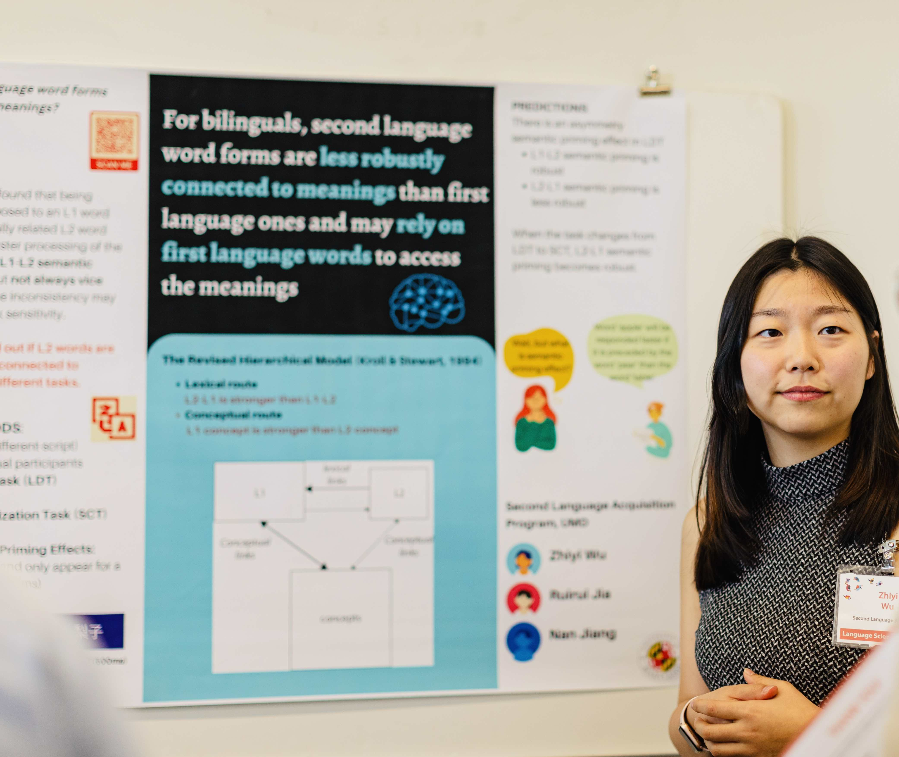

<figcaption style="font-size: 0.8em; font-style: italic;">Presenting the semantic priming project at Language Science Day 2023, College Park, MD</figcaption>

## Late language learners are everywhere. 

It amazes me why these learners sometimes just cannot understand or produce their target language as well as those who started learning it from birth. One big reason is the already-established knowledge of a first language (L1). Sometimes, aspects of the L1 can help us learn a second language (L2), but some other times, they can really hinder the learning process. I am interested in cross-linguistic influences, i.e., how certain aspects of an L1 can interfere with the learning and processing of an L2, mainly when it comes to phonetics and phonology. Human sounds are just fascinating, right?! 

But there are also so many other components that are so cool to look at. Below, you can see the projects that I have worked on during my PhD, chronologically ordered.

## Project 1: The Influence of L1 Allophony

My first big project during my PhD is about **the Influence of Native-Language Allophony on Nonnative Phonemic and Phonolexical Representations**. 

Under the mentorship of [Kira Gor](https://sllc.umd.edu/directory/kira-gor), I investigated the impact of phonemic and allophonic representations on the phonological and lexical processing of late language learners within the auditory domain. While research on L2 phonological encoding often assumes that cross-language influence operates at the phonemic level, I explored the nuanced impact of allophonic variation in L1 and an L1-L2 mismatch between allophones and phonemes on L2 phonetic categorization and phonological encoding. My research focused on learners of Spanish who speak American English and Mandarin Chinese as their L1, as there is an allophonic mismatch between American English and Spanish, while there is a phonemic mismatch between Mandarin and Spanish, which is perfect for my research goal!

**Our findings:**

_1. Unlike the persistent negative influence of a phonemic mismatch, an allophonic mismatch could be beneficial for L2 phonological encoding, especially at higher L2 proficiency levels_. 

_2. There is a significant relationship between the oddity task performance and lexical decision accuracy among Chinese NSs, but not AE learners_, indicating a close link between phonetic categorization and phonolexical encoding for perceptually challenging phonemes, but not for robustly acquired phonemes.

This paper is currently under revision for a journal. If you are interested in the topic, feel free to check out the materials, datasets, and analysis publicly shared on [OSF](https://osf.io/v6esc/). **I support open science!**

## Project 2: The Reliability of RT-difference-measures

For decades, psycholinguistic researchers have relied on various measures, particularly those based on reaction times, to gain insights into the human mind. My other advisor,[Bronson Hui](https://sllc.umd.edu/directory/bronson-hui), read about the potential unreliability of these measures from some good papers and then suggested something scary: Let's look into **The Reliability of RT-difference-based Psycholinguistic Measures**! So there I was, worried about what we should do if we find unacceptable levels of reliability for these measures that have been used for decades by so many big names. 

Thank goodness, we were not trying to challenge anyone, because this is not new news. People already knew. All we did was to find out what we can do to help **save** the unreliability. It turned out that a model-based approach could potentially help! To know more about exactly what we did, see [our paper on SSLA](https://www.cambridge.org/core/journals/studies-in-second-language-acquisition/article/estimating-reliability-for-responsetime-difference-measures-toward-a-standardized-modelbased-approach/A00BECC935D1BD4915144F6985193766) and try to run our code publicly shared on [OSF](https://osf.io/cd5r8/). **Again, I support open science!**

While we were celebrating the recognition of the method with ice cream, a replication study by [Huensch (2024)](https://www.cambridge.org/core/journals/studies-in-second-language-acquisition/article/clarifying-the-role-of-inhibitory-control-in-l2-phonological-processing-a-preregistered-close-replication-of-darcy-et-al-2016/1B3C56DC41EFB09D8F8B82DBD22A785E) came out with a finding different from the initial replicated study by [Darcy and colleagues (2016)](https://onlinelibrary.wiley.com/doi/10.1111/lang.12161). While Darcy et al. (2016) found a significant relationship between inhibitory control (IC) and L2 phonological processing, Huensch (2024) did not find it. What caught our eye was that all the IC measures were RT-based. Oh well, then, could it be that the null effects were due to the unreliability of the IC measures?

Nope. We successfully ruled out unreliability as an explanation for null effects, because even after we improved the reliability of those IC measures with model-based approaches, we did not see any stars coming from the correlation and regression analyses. The paper, based on our reanalysis of Huensch's (2024) datasets, has been accepted (pending revisions) by SSLA. While you patiently wait for our revisions to be complete and the paper to be published, if you want a preview, you can see the slides for our AAAL conference talk [here](https://docs.google.com/presentation/d/1uBD1XfeauY1oTm13Yb3KUiDGJaBn3scHv-0sLwnDm_w/edit?usp=drive_link) and also play with our code that is publicly shared on [OSF](https://osf.io/bng82/). **Once again, I support open science!**

<figure>
    

    <figcaption style="font-size: 0.8em; font-style: italic;">Presenting the reliability project at AAAL 2025, Denver, CO</figcaption>
</figure>

## Project 3: Cross-language Translation and Semantic Priming Effects

Even though the RT-difference-based measures are found to be in a reliability crisis, I would still be using them since we have seemingly found some solutions (and so I don't have to scratch my head to invent something new)! Another aspect of language processing that interests me is meaning, i.e., semantics. The concepts denoted by language are notoriously difficult to tease apart from language forms themselves. After all, they are so intertwined! 

Working with [Nan Jiang](https://sllc.umd.edu/directory/nan-jiang), I am investigating how bilinguals organize and access word meanings in their different languages. My research uses semantic priming in lexical decision tasks to examine whether semantic networks are equally well-developed in L1 and L2. This project is still underway.

## Project 3: DISSERTATION

(Still under development.) More to come soon!
